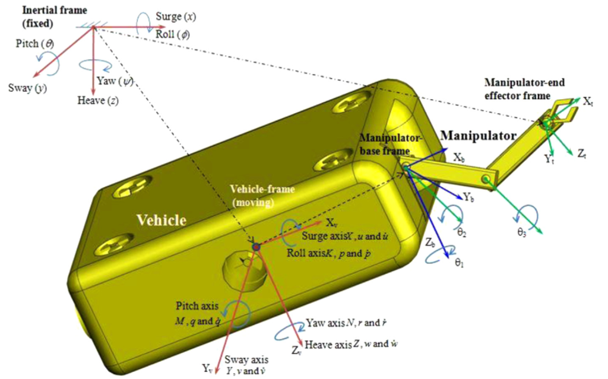

## Autonomous underwater manipulator

Os veículos subaquáticos desempenham um importante papel nas atuais atividades submarinas, ao atuar, por exemplo, nas investigações científicas e militares e na exploração de pétroleo off-shore. Para tanto, os veículos são equipados com um ou mais manipuladores e formam um sistema amplamente utilizado na literatura (UVMS, *Underwater Vehicle Manipulator Systems*), como no exemplo apresentado na Figura 1. A fim de melhorar a efiência e diminuir os custos do trabalho, foram desenvolvidos os veículos subáquaticos autônomos (AUVMS, do inglês *Autonomous  Underwater  Vehicle  Manipulator  Systems*) [[1]](#1). Devido a essas vantagens e visando uma nova abordagem, muitos estudiosos e engenheiros se lançaram na pesquisa de controle do UVMS para melhorar o nível de automação na esperança de realizar a manipulação autônoma [[2]](#2).

Neste contexto, diversos estudos foram realizados para os UVMS com a finalidade de controle de posição do veículo. O manipulador acoplado faz parte de um sistema completo, tornando o veículo um conjunto único com o manipulador. Dessa forma, o controle da estabilidade da posição do veículo subaquático é trabalhado de forma a compensar as perturbações ocasionadas com o deslocamento do manipulador até o seu objetivo. Assim, quando o manipulador realizar o deslocamento até um ponto, a trajetória calculada será feita a partir de um ponto fixo. Deve-se enfazitar que se houver deslocamento devido as perturbações das correntezas oceânicas, o manipulador precisará interromper sua execução e realizar um novo planejamento. Por isso, este projeto visa estudar e comparar os métodos de técnicas de planejamento dinâmico de trajetória dos braços subaquáticos, levando em consideração as perturbações e/ou deslocamentos de sua base.

A metodologia empregará um estudo dos algoritmos de planejamento de trajetória dinâmico para manipuladores, a partir de métodos estatísticos e comparativos. O desenvolvimento é feito padronizando os métodos e elementos para que sejam compatíveis com o framework de Sistema Operacional de Robô (ROS, do inglês *Robot Operation System*) na versão Noetic. Além disso, serão elaborados o SOTA, para as técnicas de planejadores dinâmicos e para os UVMS, a AHP, para estimar a técnica que mais se enquadra dentro da aplicação, e o DOE, para o planejamento dos testes que serão aplicados a cada método.

## Equipe 
<table border="0">
  <tr>
    <td><b style="font-size:15px">
Anderson Queiroz</b></td>
    <td><b style="font-size:15px">
Brenda Alencar</b></td>
    <td><b style="font-size:15px">
Marco Reis</b></td>
  </tr>
  <tr>
    <td>
</td>
    <td>
</td>
    <td>
</td>

  </tr>
  <tr>
    <td> Engenheiro de Computação</td>
    <td>Graduanda em Engenharia Elétrica</td>
    <td>Mestre em Engenharia de Produção e Eng. Eletricista. Líder do projeto turBOT e do RoSA</td>
  </tr>
</table>

## Referências
#### 1
  SANTHAKUMAR, M.;  KIM, J. Robust adaptive tracking control of autonomousunderwater vehicle-manipulator systems.Journal  of  Dynamic  Systems,  Measurement,and Control, American Society of Mechanical Engineers Digital Collection, v. 136, n. 5,2014.  
#### 2
  [2] DANNIGAN, M.; RUSSELL, G. T. Evaluation and reduction of the dynamic couplingbetween a manipulator and an underwater vehicle.IEEE Journal of Oceanic Engineering,IEEE, v. 23, n. 3, p. 260–273, 1998.   
