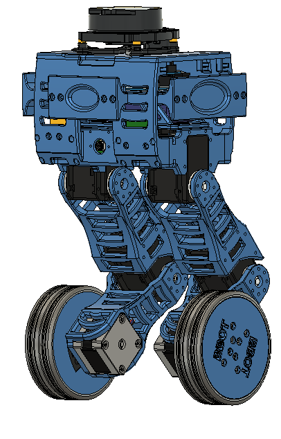

    

**Bbot** ou _Balancing Robot_, é um projeto de robô autônomo auto-balanceado. Nosso objetivo é construir um robô móvel operado via **ROS Noetic** capaz de **se equilibrar e se deslocar sobre duas rodas**. Ademais, ele deve ser capaz de realizar a leitura de uma TAG (marco fiducial). A TAG enviará ao robô uma posição de destino à qual ele deve **navegar de forma autônoma**. Para realizar a navegação, esse robô deverá ser capaz de **criar um mapa do local onde está e se localizar nele**, permitindo-o atualizar sua posição ao longo da missão e **desviar de obstáculos** enquanto navega até seu objetivo. 

### DESIGN E CARACTERÍSTICAS

**Bbot** conta com um _design_ adequado ao seu modo de atuação. Sua baixa estatura, aproximadamente 36 cm, permite uma fácil manipulação e operação em ambientes _indoor_. Sua forte estrutura, com peças para amortecer impacto, o protegem de eventuais quedas. Além disso, boa parte da sua massa foi alocada na parte superior, o que é uma grande vantagem para robôs auto-balanceados, pois a elevação do ponto de gravidade auxilia no equilíbrio.

Outra grande vantagem do **Bbot** são suas pernas articuladas com 2 graus de liberdade (DOF - _Degrees of freedom_). 

### TECNOLOGIA ENVOLVIDA

O **Bbot** é equipado para a ação. Com seus diversos componentes ele pode realizar tarefas em ambientes indoor.

| O robô conta com dois controladores, o principal é um Raspberry Pi 4 e suporta o ROS Noetic, já o secundário é um OpenCM9.04 com uma placa de expansão (OpenCM 485) e cuida das entradas e saídas dos atuadores. | |
|----|---|

|  | Já na parte de atuação, temos 2 _dynamixels MX106_ na parte da perna e 1 _Nema 17_ para locomoção da roda. As rodas são envolvidas em borracha de silicone, tornando o pneu mais aderente ao solo. |
|----|---|

O **bbot** conta ainda com sensores que são responsáveis por aquisições de dados em tempo real e um sistema de controle de potência!!

|  O LiDAR (Light Detection And Ranging), é um sensor que pode revelar a geometria do ambiente ao seu redor. A câmera RGB é capaz de detectar e codificar cores no espaço. |  |
|----|---|

|  | O IMU detecta variações na inclinação do robô e o sensor de tensão é usado para o controle de falhas. |
|----|----|

| O sistema é alimentado por uma LiPO 3s e conta com uma placa para distribuir a energia aos componentes. Também comporta um regulador de tensão para energizar a Raspberry Pi 4. |  |
|----|----|

### EQUIPE DE DESENVOLVIMENTO

| <figure> <figcaption>**Matheus França**</figcaption></figure> |     **Estagiário no laboratório de Robótica e Sistemas Autônomos (RoSA), Senai Cimatec, graduando em Engenharia de Controle e Automação na Área 1.**|
|----------------|-----------|
| <figure> <figcaption>**Lucas Souza**</figcaption></figure>    |     **Estagiário no laboratório de Robótica e Sistemas Autônomos (RoSA), Senai Cimatec, graduando em Engenharia Elétrica no Senai**|   
| <figure> <figcaption>**Marco Reis**</figcaption></figure>    |     **Lidera o grupo de Robótica e Sistemas Autônomos (RoSA), Senai Cimatec. Formado em engenharia elétrica pela UFPR e mestrado em engenharia de produção pela UFSC, atualmente é doutorando no curso de pós-graduação em Mecatrônica da UFBA.**|  