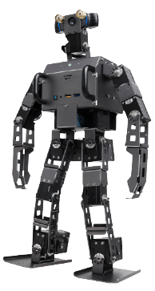
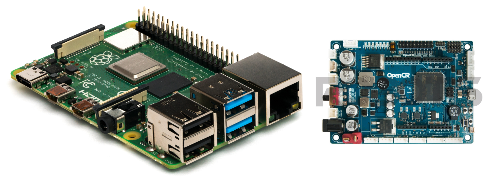
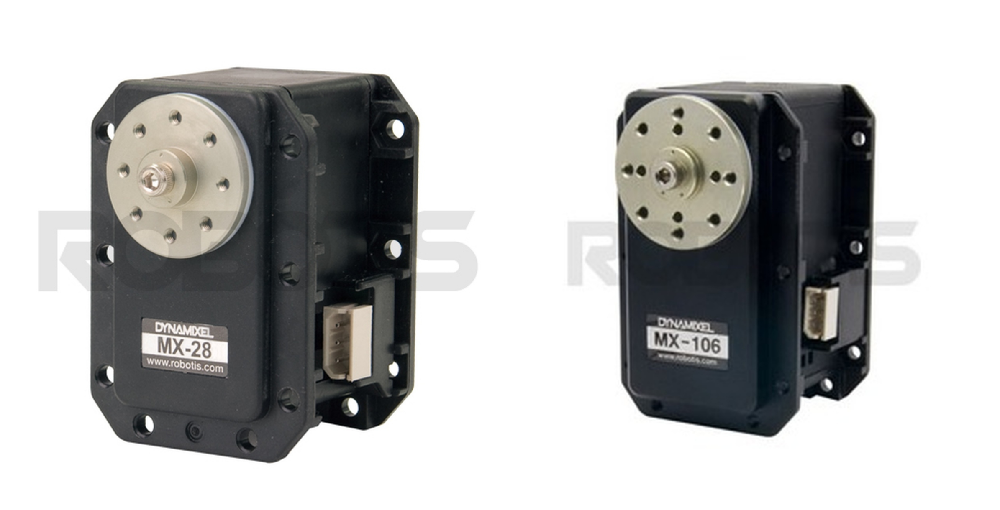
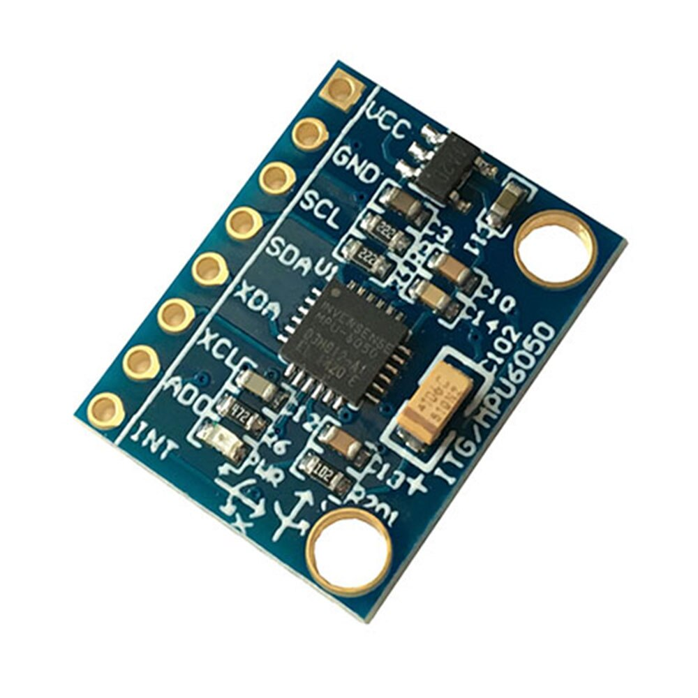
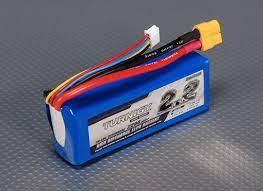
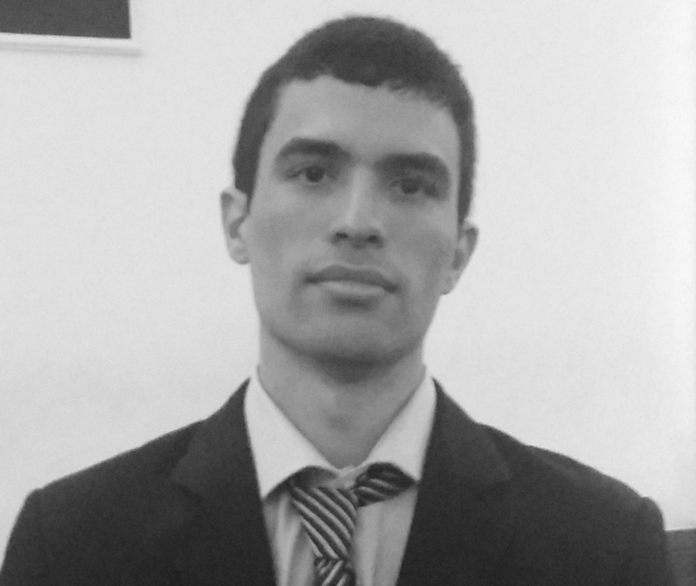

    

A robótica tem sido impulsionada pelas possibilidades da utilização de robôs para auxiliar o ser humano. O projeto de um sistema robótico humanoide visa obter uma máquina adaptada ao ambiente humano e que possa realizar tarefas para auxiliar as pessoas com maior adaptabilidade e facilidade de execução. O **Hefesto** é um projeto de robô autônomo com arquitetura aberta que visa o avanço nas tecnologias de robôs antropomórficos.

### DESIGN E CARACTERÍSTICAS

**Hefesto** conta com um _design_ articulado de 20 graus de liberdade (DOF - _Degrees of freedom_). Sua estrutura é baseada nos modelos da _Robotis_ Op3 e Op2. Além disso o **Hefesto** é desenvolvido sob ROS (Robot Operating System) para utilizar vários pacotes no ecossistema ROS. Toda tecnologia envolvida e suporte ao ROS, permitem que os desenvolvedores se concentrem mais no avanço de pesquisas e técnicas na área da robótica e visão computacional.

### TECNOLOGIA ENVOLVIDA

O **Hefesto** é equipado com uma gama de tecnologias!! 

| O robô conta com dois controladores, o principal é um Raspberry Pi 4 e suporta o ROS Noetic, já o secundário é um OpenCR e cuida das entradas e saídas dos atuadores. | |
|----|---|

|  | Já na parte de atuação, temos 2 _dynamixels MX106_ na parte da pelvis e 18 _dynamixels MX28_ espalhados nas diversas articulações do robô.|
|----|---|

O **hefesto** conta ainda com sensores que são responsáveis por aquisições de dados em tempo real.

| A câmera RGB Stereo é capaz de detectar e codificar cores no espaço. |  |
|----|---|

|  | O IMU detecta variações na inclinação do robô. |
|----|----|

| O sistema é alimentado por uma LiPO 3s e a OpenCR distribui a energia aos componentes. |  |
|----|----|

### EQUIPE DE DESENVOLVIMENTO

| <figure> <figcaption>**Matheus França**</figcaption></figure>|**Estagiário no laboratório de Robótica e Sistemas Autônomos (RoSA), Senai Cimatec, graduando em Engenharia de Controle e Automação na Área 1.**|
|----------------|-----------|
| <figure> <figcaption>**Breno Portela**</figcaption></figure>|**Bolsista no laboratório de Robótica e Sistemas Autônomos (RoSA), Senai Cimatec, graduado em Engenharia Mecânica no Senai Cimatec.**|   
|<figure> <figcaption>**Marco Reis**</figcaption></figure>|**Lidera o grupo de Robótica e Sistemas Autônomos (RoSA), Senai Cimatec. Formado em engenharia elétrica pela UFPR e mestrado em engenharia de produção pela UFSC, atualmente é doutorando no curso de pós-graduação em Mecatrônica da UFBA.**|  